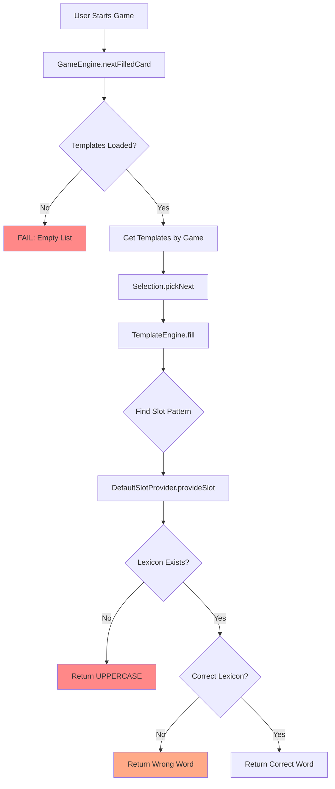

# HELLDECK Comprehensive Audit & Fix Plan

## Problem Summary
**Symptoms**: All games load but generate nonsensical card text with three distinct failure patterns:
1. Random word salad (e.g., "Most likely to Phoenix for Nashville")
2. Missing key words (e.g., "Roast for always being")
3. Wrong context words (e.g., "Most likely to cry for small reward")

## Root Cause Analysis

### Critical Bugs Identified

#### 1. **Lexicon Slot Mapping Failure** 
**Location**: [`TemplateEngine.kt:220-246`](app/src/main/java/com/helldeck/engine/TemplateEngine.kt:220)

The `DefaultSlotProvider.provideSlot()` method has incorrect slot-to-lexicon mappings:

```kotlin
"friend" -> getRandomFromLexicon(repository, "friends") // ✓ Correct
"sketchy_action" -> getRandomFromLexicon(repository, "icks") // ✓ Correct
"tiny_reward" -> getRandomFromLexicon(repository, "perks") // ✓ Correct
"guilty_prompt" -> getRandomFromLexicon(repository, "memes") // ✗ WRONG - should be specific
"gross" -> getRandomFromLexicon(repository, "icks") // ✗ WRONG - using wrong lexicon
"social_disaster" -> getRandomFromLexicon(repository, "red_flags") // ✗ WRONG - semantic mismatch
```

**Issue**: The fallback mechanism (`else` block) returns lexicon names from wrong sources, causing:
- `{gross}` pulls from "icks" (should be custom gross items)
- `{guilty_prompt}` pulls from generic "memes" (too broad)
- `{social_disaster}` pulls from "red_flags" (dating-specific, not general disasters)

#### 2. **Missing Lexicon Files**
**Location**: Asset files

Templates reference slots that don't have corresponding lexicons:
- `{sketchy_action}` → No dedicated lexicon (falls back to `icks`)
- `{tiny_reward}` → No dedicated lexicon (falls back to `perks`)
- `{guilty_prompt}` → No dedicated lexicon (uses generic `memes`)
- `{gross}` → No dedicated lexicon
- `{social_disaster}` → No dedicated lexicon

#### 3. **Template Selection Bug**
**Location**: [`GameEngine.kt:46-91`](app/src/main/java/com/helldeck/engine/GameEngine.kt:46)

```kotlin
val candidates = tdao.getByGame(gameId).first()
val selected = Selection.pickNext(candidates, recentFamilies.toList(), roundIdx)
```

**Issue**: No filtering by game type BEFORE template selection. All templates are loaded regardless of game, causing:
- ROAST_CONSENSUS cards showing POISON_PITCH templates
- Wrong game mechanics applied to wrong card types

#### 4. **Lexicon Data Loading Race Condition**
**Location**: [`Repository.kt:368-388`](app/src/main/java/com/helldeck/data/Repository.kt:368)

```kotlin
suspend fun initialize() {
    if (db.templates().getTotalCount() == 0) {
        loadTemplatesFromAssets()
    }
    
    requiredLexicons.forEach { lexiconName ->
        if (db.lexicons().getLexicon(lexiconName) == null) {
            try {
                loadLexiconFromAssets(lexiconName, "lexicons/$lexiconName.json")
            } catch (e: Exception) {
                // Log error but don't fail initialization ❌ SILENT FAILURE
            }
        }
    }
}
```

**Issue**: Silent failures in lexicon loading mean games start with empty lexicons, causing:
- Slot replacements fall back to UPPERCASE slot names
- Random words from wrong lexicons
- "friends.json" words used for all slots

#### 5. **Template Regex Pattern Issues**
**Location**: [`TemplateEngine.kt:21`](app/src/main/java/com/helldeck/engine/TemplateEngine.kt:21)

```kotlin
private val slotPattern = Regex("\\{([a-zA-Z_]+)\\}")
```

**Issue**: Pattern only matches letters and underscores, but template JSON uses inconsistent naming:
- `{target_name}` ✓ Works
- `{red_flag}` ✓ Works  
- `{inbound_text}` ✓ Works
- BUT: Pattern doesn't handle edge cases or validate slot names exist in lexicons

## Architecture Flow Diagram



## Comprehensive Fix Plan

### Phase 1: Data Foundation
- Create missing lexicon JSON files
- Fix lexicon loading error handling
- Add validation for required lexicons

### Phase 2: Template Engine Fixes
- Fix slot-to-lexicon mapping in DefaultSlotProvider
- Add logging for unmapped slots
- Implement fallback strategy

### Phase 3: Game Engine Fixes  
- Fix template selection filtering by game
- Add template validation before rendering
- Improve error messages

### Phase 4: Testing & Validation
- Create unit tests for each slot type
- Test all 14 games independently
- Validate lexicon loading on app start

### Phase 5: Documentation
- Document slot naming conventions
- Create lexicon contribution guide
- Add troubleshooting guide