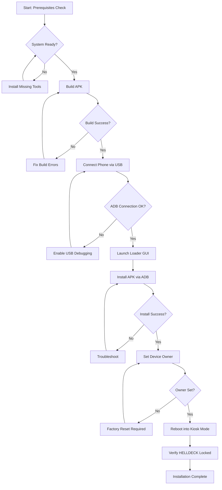

# HELLDECK Installation Plan - Moto G Play 24

## Overview
Full automated installation with kiosk mode for HELLDECK party game app on Moto G Play 24. This will build the APK from source, install it on your factory-reset phone, and configure device owner mode to lock the phone into HELLDECK.

## Installation Workflow



## Prerequisites

### Computer Requirements
- **Operating System**: macOS Ventura (confirmed)
- **Java JDK**: Version 17 or higher
- **Android SDK**: Platform Tools 34+
- **ADB**: Android Debug Bridge
- **Python**: 3.7+ (for loader GUI)
- **Gradle**: 8.5.2+ (bundled with project)

### Phone Requirements
- **Device**: Moto G Play 24
- **State**: **MUST BE FACTORY RESET** (device owner setup requirement)
- **USB Debugging**: Enabled in Developer Options
- **USB Connection**: Working cable that supports data transfer

### Build Requirements
- **Free Disk Space**: ~2GB for build artifacts
- **Network**: Internet connection for Gradle dependencies

## Installation Steps

### Phase 1: Prerequisites Verification
1. **Check Java Installation**
   ```bash
   java -version  # Should show 17 or higher
   ```

2. **Check ADB Installation**
   ```bash
   adb version  # Should show Android Debug Bridge
   ```

3. **Check Python Installation**
   ```bash
   python3 --version  # Should show 3.7 or higher
   ```

4. **Install Python Dependencies**
   ```bash
   cd /Users/nicholastoledo/CascadeProjects/HELLDECK
   pip install tkinter  # Note: Most items in requirements.txt are built-in
   ```

### Phase 2: Phone Preparation
1. **Factory Reset Phone** (if not already done)
   - Settings → System → Reset → Factory data reset
   - **WARNING**: This erases all data

2. **Enable Developer Options**
   - Settings → About phone
   - Tap "Build number" 7 times
   - Enter PIN if prompted

3. **Enable USB Debugging**
   - Settings → System → Developer options
   - Toggle "USB debugging" ON

4. **Connect Phone**
   - Use USB cable to connect phone to computer
   - On phone, tap "Allow" on USB debugging prompt
   - Check "Always allow from this computer"

### Phase 3: Build APK
1. **Navigate to Project**
   ```bash
   cd /Users/nicholastoledo/CascadeProjects/HELLDECK
   ```

2. **Make Gradlew Executable**
   ```bash
   chmod +x gradlew
   ```

3. **Build Release APK**
   ```bash
   ./gradlew :app:assembleRelease
   ```
   
   Expected output location: `app/build/outputs/apk/release/app-release.apk`

### Phase 4: Installation via Loader
1. **Launch HELLDECK Loader**
   ```bash
   python3 loader/helldeck_loader.py
   ```

2. **Verify Device Connection**
   - GUI should show "✅ Device connected"
   - If not, check USB cable and debugging permissions

3. **Browse for APK**
   - Click "Browse" button
   - Navigate to `app/build/outputs/apk/release/`
   - Select `app-release.apk`

4. **Install APK**
   - Click "📱 Install APK" button
   - Wait for installation progress
   - Should show "✅ APK installed successfully"

### Phase 5: Kiosk Mode Setup
1. **Set Device Owner**
   - Click "🔒 Set Device Owner" button
   - This executes: `adb shell dpm set-device-owner com.helldeck/.admin.HelldeckDeviceAdminReceiver`
   - Should show "✅ Device owner set successfully"
   
   **If this fails**: Phone was not factory reset or has accounts configured

2. **Reboot Device**
   - Click "🔄 Reboot Device" button
   - Confirm reboot prompt
   - Phone will restart into HELLDECK kiosk mode

### Phase 6: Verification
1. **Confirm Kiosk Mode Active**
   - Phone should boot directly into HELLDECK
   - Home button should not work
   - Cannot exit to other apps
   - Status bar hidden

2. **Test Game Functionality**
   - Verify touch controls work
   - Check that cards load properly
   - Test vibration and torch features

## Alternative: Manual Installation

If the GUI loader has issues, you can use manual ADB commands:

```bash
# Verify device connected
adb devices

# Install APK
adb install -r app/build/outputs/apk/release/app-release.apk

# Set device owner (phone must be factory reset)
adb shell dpm set-device-owner com.helldeck/.admin.HelldeckDeviceAdminReceiver

# Reboot
adb reboot
```

## Troubleshooting

### Build Fails
- **Issue**: Gradle build errors
- **Solution**: Run `./gradlew clean` then retry build

### Device Not Detected
- **Issue**: ADB doesn't see phone
- **Solution**: 
  - Check USB cable (try different cable)
  - Revoke USB debugging authorizations on phone
  - Restart ADB: `adb kill-server && adb start-server`

### Device Owner Fails
- **Issue**: "Not allowed to set device owner" error
- **Solution**: Phone MUST be factory reset with no Google/user accounts
- **Alternative**: Use Screen Pinning instead (Settings → Security → Screen pinning)

### APK Install Fails
- **Issue**: Installation blocked
- **Solution**: 
  - Enable "Install unknown apps" for ADB
  - Uninstall any existing HELLDECK version first

### Kiosk Mode Not Working
- **Issue**: Can still exit HELLDECK
- **Solution**: Verify device owner was set successfully with:
  ```bash
  adb shell dpm list-owners
  ```

## How to Exit Kiosk Mode Later

Once in kiosk mode, to exit:

1. **Via ADB (from computer)**
   ```bash
   adb shell dpm remove-active-admin com.helldeck/.admin.HelldeckDeviceAdminReceiver
   adb reboot
   ```

2. **Or use the "Clear Device Owner" button in loader GUI**

## Technical Details

### Signing Configuration
- **Debug Build**: Uses Android debug keystore
- **Release Build**: Uses project keystore (configured in `app/build.gradle`)

### Permissions Required
- VIBRATE (for feedback)
- CAMERA (for torch flash)
- WAKE_LOCK (prevent sleep during game)
- BIND_DEVICE_ADMIN (for kiosk mode)

### App Configuration
- **Package**: com.helldeck
- **Min SDK**: 21 (Android 5.0)
- **Target SDK**: 34 (Android 14)
- **App Size**: ~10MB

## Next Steps After Installation

1. **Test all 14 mini-games** to ensure functionality
2. **Configure game settings** (if needed via in-app settings)
3. **Learn the controls**:
   - Long-press = draw new card
   - Left/Right tap = cycle options
   - Center tap = confirm
   - Two-finger tap = back/undo
   - Vibrate = phase change
   - Torch flash = scoring lock

4. **Export brainpack** later to save learned preferences:
   - Home → Export Brain → creates `.hhdb` file
