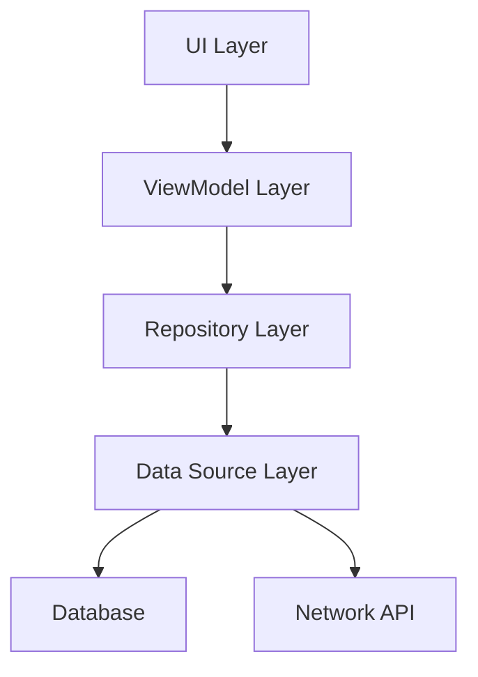

# Helldeck Architecture

## 1. Introduction

This document provides a comprehensive overview of the software architecture of the Helldeck application. The purpose is to detail the high-level structure of the system, its main components, and the relationships between them.

## 2. Architectural Goals and Constraints

* **Goal:** To create a robust and scalable architecture for a mobile application.
* **Constraint:** The application is developed natively for the Android platform.
* **Constraint:** The architecture must support offline functionality and data persistence.

## 3. System Overview

Helldeck is a content-driven mobile application designed around a card-game-like experience. The core of the application involves a "content engine" that uses templates and lexicons (collections of terms) to generate dynamic content for the user. The architecture is designed to be modular, allowing for easy expansion of content and features.

## 4. Component Diagram

*(A diagram illustrating the major components of the application and their interactions.)*

## 5. Layers

### 5.1. UI Layer (View)

*   **Description:** Responsible for displaying the application's user interface and handling user input.
*   **Technologies:** Jetpack Compose.
*   **Components:** Activities, Composables, Navigation Compose.

### 5.2. ViewModel Layer

*   **Description:** Acts as a bridge between the UI and the business logic. It holds and processes UI-related data, exposing it to the UI via observable streams.
*   **Technologies:** Android ViewModel with Kotlin Coroutines and StateFlow/LiveData.
*   **Responsibilities:**
    *   Survives configuration changes.
    *   Exposes data to the UI via LiveData or StateFlow.
    *   Calls methods in the Repository to fetch or update data.

### 5.3. Repository Layer

*   **Description:** Mediates between different data sources (e.g., network, local database). It provides a clean API for data access to the rest of the application.
*   **Responsibilities:**
    *   Fetching data from remote or local sources.
    *   Caching data.
    *   Centralizing data logic.

### 5.4. Data Source Layer

*   **Description:** Manages the actual data operations. It can be divided into remote and local data sources.
*   **Components:**
    *   **Remote Data Source:** Currently, there is no remote data source. The application works entirely offline.
    *   **Local Data Source:** Manages local data persistence using the Room Persistence Library. It also reads from asset files (`.json`, `.yaml`) for initial data seeding and content generation.

## 6. Cross-Cutting Concerns

### 6.1. Dependency Injection

*   **Framework:** None identified.
*   **Description:** The project does not currently use a dedicated dependency injection framework like Dagger or Hilt. Dependencies are likely managed manually.

### 6.2. Concurrency

*   **Framework:** Kotlin Coroutines
*   **Description:** Used extensively for managing background threads and simplifying asynchronous operations, particularly for database access and data processing.

## 7. Data Persistence

*   **Database:** Room Persistence Library
*   **Description:** Provides an abstraction layer over SQLite to allow for more robust database access.

## 8. Testing

*   **Unit Tests:** JUnit, MockK, Robolectric, and Turbine for testing Kotlin Flows.
*   **UI Tests:** Espresso and Jetpack Compose test rules for UI and integration testing.

## 9. Repository Structure

The Helldeck repository is organized into several key directories:

*   **`/app`**: This is the main module for the Android application.
    *   **`/src/main/java`**: Contains all the Kotlin source code for the application.
        *   **`/com/helldeck/content`**: The core content engine, responsible for managing, processing, and validating all in-game content.
        *   **`/com/helldeck/engine`**: The main game engine, which orchestrates the overall application flow and gameplay mechanics.
        *   **`/com/helldeck/ui`**: Contains all the Jetpack Compose UI components, themes, and scenes.
    *   **`/src/main/assets`**: Includes all the raw content for the game, such as templates and lexicons, stored in JSON and YAML files.
    *   **`/src/test`**: Unit tests for the application.
    *   **`/src/androidTest`**: Instrumented tests for the application.
*   **`/docs`**: Contains all project-related documentation, including this architecture document.
*   **`/Heimdall`**: A submodule for the Heimdall flashing tool. This is likely used for device management or debugging and is not directly part of the application's runtime architecture.
*   **`/gradle`**: Gradle wrapper files.

## 10. Future Considerations

*(This section can include potential improvements, planned features, or areas for refactoring.)*